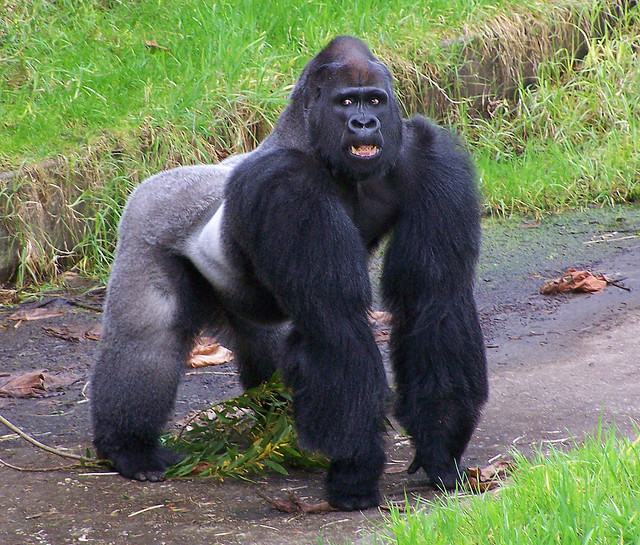
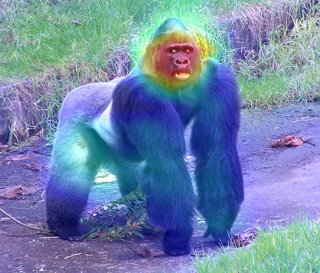

## Grad_CAM （CNN_visualization)
複雜的CNN中使用Grad_CAM技術將CNN最後一層output對圖像提取的特征進行可視化

Original input

將heating map疊加原圖效果

Enviroment

Python 3.7

module you need
Keras
* Pretrained_VGG16
matplotlib
numpy
openCV

參考論文：
https://arxiv.org/pdf/1610.02391v1.pdf
